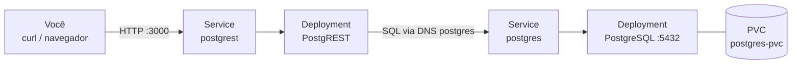
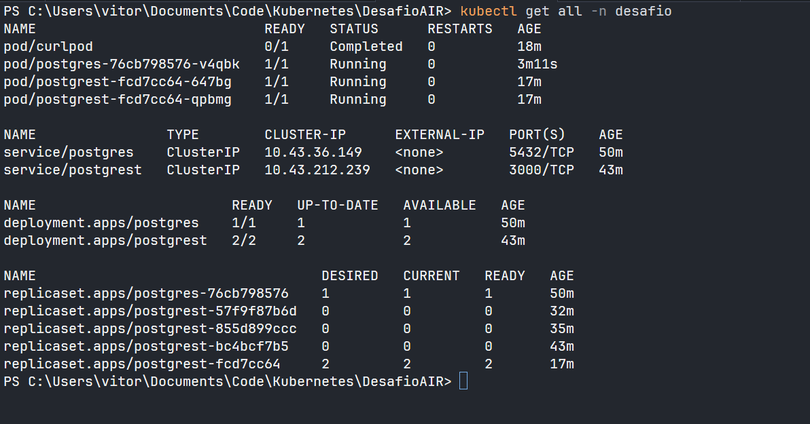
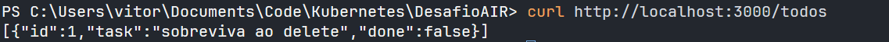
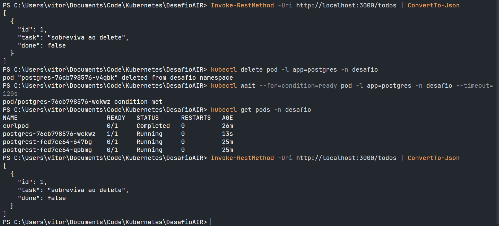

# Desafio S7: Fundamentos de Kubernetes na Prática

API REST (PostgREST) + PostgreSQL em cluster Kubernetes local, com dados persistentes
via PVC, configuração externalizada (ConfigMap/Secret), probes de saúde, recursos e HPA.

**Autor:** José Vitor do Nascimento Rodrigues
**Contexto:** Desafio do estágio em CloudOps na AI/R Company (Semana 7, individual)
**Ferramenta de cluster:** Rancher Desktop (k3s), Windows 11 + WSL2.

## Arquitetura



## Estrutura

```text
k8s/
├── 00-namespace.yaml            # Namespace "desafio" (isola todos os recursos)
├── 01-secret.yaml               # credenciais do Postgres (usuário/senha)
├── 02-configmaps.yaml           # POSTGRES_DB, PGDATA e config do PostgREST
├── 10-postgres-pvc.yaml         # PersistentVolumeClaim 1Gi
├── 11-postgres-deployment.yaml  # PostgreSQL 16 + volume montado
├── 12-postgres-service.yaml     # Service ClusterIP "postgres" (DNS interno)
├── 20-postgrest-deployment.yaml # API PostgREST: probes, resources, 2 réplicas
├── 21-postgrest-service.yaml    # Service ClusterIP "postgrest"
└── 30-hpa.yaml                  # HPA: 2-5 réplicas por CPU (bônus)
```

## Como aplicar

```bash
kubectl apply -f k8s/
kubectl get pods -n desafio -w   # aguarde tudo Running/Ready
```

## Criar a tabela (uma vez)

```bash
kubectl exec -it deploy/postgres -n desafio -- psql -U admin -d appdb -c "CREATE TABLE IF NOT EXISTS todos (id serial primary key, task text not null, done boolean default false);"
```

## Testar a integração (API ↔ banco)

```bash
kubectl port-forward svc/postgrest 3000:3000 -n desafio   # terminal 1

curl -X POST http://localhost:3000/todos -H "Content-Type: application/json" -d '{"task":"dado via API"}'
curl http://localhost:3000/todos                          # GET lista o dado
```

## Testar a persistência

```bash
kubectl delete pod -l app=postgres -n desafio
kubectl wait --for=condition=ready pod -l app=postgres -n desafio --timeout=120s
curl http://localhost:3000/todos   # o dado continua lá: o PVC sobreviveu ao Pod
```

## HPA (bônus)

O Rancher Desktop já traz metrics-server. Com `30-hpa.yaml` aplicado:

```bash
kubectl get hpa -n desafio -w
kubectl run carga --rm -it --image=busybox:1.36 -n desafio --restart=Never -- sh -c "while true; do wget -q -O- http://postgrest:3000/todos > /dev/null; done"
```

## Evidências

`kubectl get all -n desafio` mostrando PostgreSQL + 2 réplicas do PostgREST `Running`:



API servindo dados do banco (`GET /todos`):



Persistência: `delete pod` no Postgres, Pod novo `qgwhr` sobe e o `GET` retorna o mesmo `id:1`:



## Limpar tudo

```bash
kubectl delete namespace desafio
```
